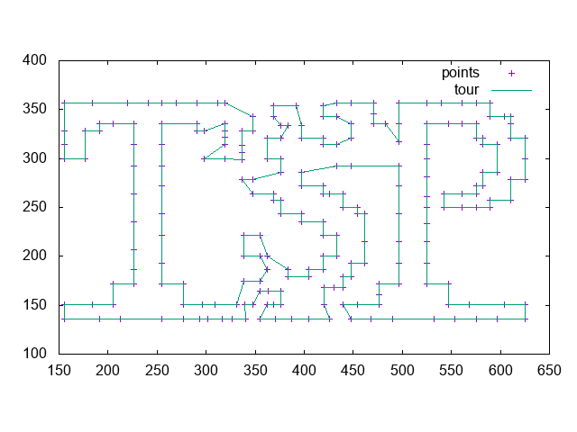

# Introduction
This includes C codes of 2-opt and 3-opt methods for [travel salesman problems](https://en.wikipedia.org/wiki/Travelling_salesman_problem).

# Compile
## 2-opt
```
gcc tsp_2opt.c tsp_tools.c -o tsp_2opt
```
## 3-opt
```
gcc tsp_3opt.c tsp_tools.c -o tsp_3opt
```
## Initializing tours
The nearest neighbor method for tour generation.
```
gcc tsp_nn.c tsp_tools.c -o tsp_nn
```
Random tour generation.
```
gcc gen_tour.c tsp_tools.c -o gen_tour
```
## Plot planar problems and tours using GNU plot
```
gcc tour_to_plot.c tsp_tools.c -o tour_to_plot
```
# How to use
Let `problem/tsp225.tsp` be a problem.

Get an initial tour by the nearest neighbor method.
```
./tsp_nn problem/tsp225.tsp 1
```
The last argument `1` is an initial node index for the nearest neighbor method.
The output is `a.tour`. It contains an order of the node indexes.

Or, get a tour randomly.
```
./gen_tour 225 1
```
The second `225` indicates the number of nodes of the condiering tour.
The last `1` is a random seed.

Compute a better tour by 3-opt
```
./tsp_3opt problem/tsp225.tsp a.tour
```
The output is also `a.tour`.
You see the following print in stdout during the 3-opt execution.
```
27: diff = 1, obj = 3857 
replace type = 2, replace pos = [108 109 128 129 110 111]
tour = [150 151 152 153 154 155 156 157 159 160 161 162 163 158 213 164 165 166 167 214 212 168 169 170 171 172 173 174 176 177 178 179 180 181 182 184 185 186 118 119 120 175 121 122 123 124 125 126 127 88 89 101 102 103 104 220 105 106 107 108 109 110 111 112 113 114 115 223 116 117 187 188 27 189 205 190 225 47 2 207 49 133 199 191 192 196 193 218 194 195 197 198 200 1 3 4 5 6 7 8 9 10 11 12 13 14 15 16 17 18 19 203 20 21 22 23 24 208 25 26 204 28 79 78 77 217 219 216 31 32 206 202 30 29 35 33 34 36 37 38 39 40 41 42 43 44 46 45 48 224 50 51 57 55 52 53 54 56 58 59 60 61 62 63 64 65 66 67 68 69 70 71 72 73 74 76 75 100 99 98 97 96 209 95 80 81 221 94 93 92 91 90 87 210 84 83 82 85 86 131 211 130 222 128 129 132 215 134 135 183 136 137 138 139 140 141 142 201 143 144 145 146 147 148 149 ]
```
The first shows a number of iteration.
`diff = 1`means the difference of objective values of the previous and current tours.
`obj = 3857` means the objective value of the current tour.
`replace type` is a type of the 3-opt replacement,
and `replace pos` is the positions of the previous tour used for the 3-opt replacement.
The last `tour` is the current tour.

Plot the result by GNU plot
```
./tour_to_plot problem/tsp225.tsp a.tour
gnuplot -p a.plt
```
You see the following graph.

